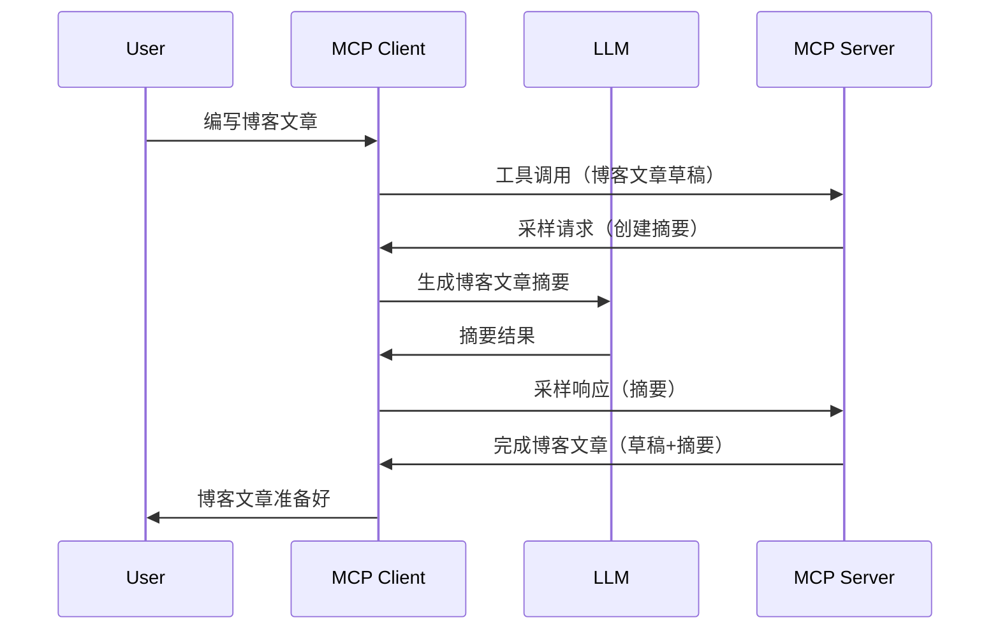

# 采样 - 将功能委托给客户端

有时，你需要 MCP 客户端和 MCP 服务器协同工作以实现共同目标。可能会遇到服务器需要借助位于客户端的 LLM 的情况。针对这种情况，采样就是你应该使用的功能。

让我们探讨一些用例以及如何构建涉及采样的解决方案。

## 概述

本课聚焦于讲解何时以及在哪里使用采样以及如何配置采样。

## 学习目标

本章我们将：

- 解释什么是采样以及何时使用。
- 展示如何在 MCP 中配置采样。
- 提供采样操作的示例。

## 什么是采样及为何使用它？

采样是一种高级功能，其工作方式如下：


### 采样请求

好了，现在我们对一个可信场景有了宏观了解，下面讲述服务器向客户端发送的采样请求。这种请求在 JSON-RPC 格式下可能如下所示：

```json
{
  "jsonrpc": "2.0",
  "id": 1,
  "method": "sampling/createMessage",
  "params": {
    "messages": [
      {
        "role": "user",
        "content": {
          "type": "text",
          "text": "Create a blog post summary of the following blog post: <BLOG POST>"
        }
      }
    ],
    "modelPreferences": {
      "hints": [
        {
          "name": "claude-3-sonnet"
        }
      ],
      "intelligencePriority": 0.8,
      "speedPriority": 0.5
    },
    "systemPrompt": "You are a helpful assistant.",
    "maxTokens": 100
  }
}
```

这里有几个值得强调的点：

- Prompt，在 content -> text 下，是我们给 LLM 的指令提示，用来摘要博客文章内容。

- **modelPreferences**。这一节就是偏好，是对如何配置 LLM 的建议。用户可以选择是否采纳这些建议或自行更改。本例中，建议了使用的模型以及速度和智能优先级。
- **systemPrompt**，这是你常用的系统提示，给你的 LLM 赋予角色人格，并包含指导说明。
- **maxTokens**，这是另一个属性，用来提示该任务推荐使用的最大 Token 数。

### 采样响应

这是 MCP 客户端最终发送回 MCP 服务器的响应，是客户端调用 LLM，等待响应后构建的消息。它在 JSON-RPC 下可能如下所示：

```json
{
  "jsonrpc": "2.0",
  "id": 1,
  "result": {
    "role": "assistant",
    "content": {
      "type": "text",
      "text": "Here's your abstract <ABSTRACT>"
    },
    "model": "gpt-5",
    "stopReason": "endTurn"
  }
}
```

注意响应是博客文章的摘要，正如我们所请求的。还要注意，使用的 `model` 并非我们最初请求的，而是将 "claude-3-sonnet" 换成了 "gpt-5"。这说明用户可以改变选用的模型，你的采样请求仅是建议。

好的，现在我们理解了主要流程，以及一个有用的任务示例“博客文章创建 + 摘要”，接下来看看需要做哪些操作才能使其正常工作。

### 消息类型

采样消息不限于文本，也可以发送图片和音频。JSON-RPC 格式在不同内容下会有不同表现：

**文本**

```json
{
  "type": "text",
  "text": "The message content"
}
```

**图片内容**

```json
{
  "type": "image",
  "data": "base64-encoded-image-data",
  "mimeType": "image/jpeg"
}
```

**音频内容**

```json
{
  "type": "audio",
  "data": "base64-encoded-audio-data",
  "mimeType": "audio/wav"
}
```

> NOTE: 想了解更详细的采样信息，请查阅[官方文档](https://modelcontextprotocol.io/specification/2025-06-18/client/sampling)

## 如何在客户端配置采样

> 注意：如果你只构建服务器端，基本无需做什么。

在客户端，你需要这样指定如下功能：

```json
{
  "capabilities": {
    "sampling": {}
  }
}
```

这样，当你的客户端初始化并连接服务器时，该配置才会被读取。

## 采样实战示例 - 创建博客文章

我们一起编写一个采样服务器，需要完成以下操作：

1. 在服务器上创建一个工具。
2. 该工具应创建一个采样请求。
3. 该工具应等待客户端采样请求的回答。
4. 最后生成工具的结果。

逐步查看代码：

### -1- 创建工具

**python**

```python
@mcp.tool()
async def create_blog(title: str, content: str, ctx: Context[ServerSession, None]) -> str:
    """Create a blog post and generate a summary"""

```

### -2- 创建采样请求

用以下代码扩展你的工具：

**python**

```python
post = BlogPost(
        id=len(posts) + 1,
        title=title,
        content=content,
        abstract=""
    )

prompt = f"Create an abstract of the following blog post: title: {title} and draft: {content} "

result = await ctx.session.create_message(
        messages=[
            SamplingMessage(
                role="user",
                content=TextContent(type="text", text=prompt),
            )
        ],
        max_tokens=100,
)

```

### -3- 等待响应并返回

**python**

```python
post.abstract = result.content.text

posts.append(post)

# 返回完整的产品
return json.dumps({
    "id": post.title,
    "abstract": post.abstract
})
```

### -4- 完整代码

**python**

```python
from starlette.applications import Starlette
from starlette.routing import Mount, Host

from mcp.server.fastmcp import Context, FastMCP

from mcp.server.session import ServerSession
from mcp.types import SamplingMessage, TextContent

import json


from uuid import uuid4
from typing import List
from pydantic import BaseModel


mcp = FastMCP("Blog post generator")

# app = FastAPI()

posts = []

class BlogPost(BaseModel):
    id: int
    title: str
    content: str
    abstract: str

posts: List[BlogPost] = []

@mcp.tool()
async def create_blog(title: str, content: str, ctx: Context[ServerSession, None]) -> str:
    """Create a blog post and generate a summary"""

    post = BlogPost(
        id=len(posts) + 1,
        title=title,
        content=content,
        abstract=""
    )

    prompt = f"Create an abstract of the following blog post: title: {title} and draft: {content} "

    result = await ctx.session.create_message(
        messages=[
            SamplingMessage(
                role="user",
                content=TextContent(type="text", text=prompt),
            )
        ],
        max_tokens=100,
    )

    post.abstract = result.content.text

    posts.append(post)

    # 返回完整的博客文章
    return json.dumps({
        "id": post.title,
        "abstract": post.abstract
    })

if __name__ == "__main__":
    print("Starting server...")
    # mcp.run()
    mcp.run(transport="streamable-http")

# 使用以下命令运行应用：python server.py
```

### -5- 在 Visual Studio Code 中测试

在 Visual Studio Code 中测试时，请执行以下操作：

1. 在终端启动服务器
1. 添加到 *mcp.json*（并确保其已启动），例如：

   ```json
   "servers": {
      "blog-server": {
        "type": "http",
        "url": "http://localhost:8000/mcp"
      }
   }
   ```

1. 输入提示语：

   ```text
   create a blog post named "Where Python comes from", the content is "Python is actually named after Monty Python Flying Circus"
   ```

1. 允许采样发生。首次测试时，会弹出附加对话框需你确认，之后会出现用于运行工具的正常对话框。

1. 查看结果。你会看到结果在 GitHub Copilot Chat 中漂亮地渲染，也可以查看原始 JSON 响应。

**附加说明**。Visual Studio Code 工具对采样有很好的支持。你可以通过以下步骤配置已安装服务器的采样访问权限：

1. 进入扩展部分。
1. 在 “MCP SERVERS - INSTALLED” 区域选择已安装服务器对应的齿轮图标。
1. 选择 “Configure Model Access”，这里可以设置 GitHub Copilot 在采样时允许使用的模型。还可以点击 “Show Sampling requests” 查看最近的采样请求。

## 练习作业

本次作业需要构建一个稍有不同的采样，即支持生成产品描述的采样集成。场景如下：

**场景**：电商的后台工作人员需要帮助，生成产品描述耗时太久。因此，你要构建一个解决方案，可调用一个名为 "create_product" 的工具，参数包括 "title" 和 "keywords"，其应生成一个完整的产品，包括由客户端 LLM 填充的 "description" 字段。

提示：利用前面学到的如何使用采样请求构建服务器和工具。

## 解决方案

[解决方案](./solution/README.md)

## 关键要点

采样是一个强大功能，当服务器需要 LLM 协助时，可以将任务委托给客户端。

## 接下来做什么

- [第4章 - 实践实现](../../04-PracticalImplementation/README.md)

---

<!-- CO-OP TRANSLATOR DISCLAIMER START -->
**免责声明**：  
本文件使用 AI 翻译服务 [Co-op Translator](https://github.com/Azure/co-op-translator) 进行翻译。虽然我们力求准确，但请注意，自动翻译可能包含错误或不准确之处。原始文件的本地语言版本应被视为权威来源。对于重要信息，建议使用专业人工翻译。对于因使用本翻译而产生的任何误解或曲解，我们不承担任何责任。
<!-- CO-OP TRANSLATOR DISCLAIMER END -->