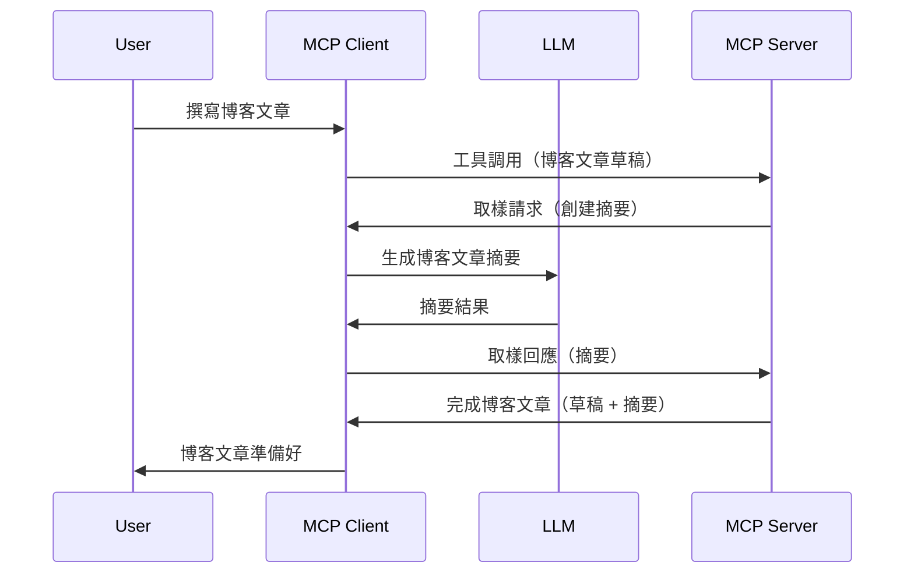

# Sampling - 將功能委派給客戶端

有時，你需要 MCP 客戶端和 MCP 伺服器合作以達成共同目標。你可能會遇到伺服器需要客戶端上 LLM 幫助的情況。對於這種情況，sampling 就是你應該使用的。

讓我們探討一些使用案例以及如何建立涉及 sampling 的解決方案。

## 概覽

本課程將重點說明何時及在哪裡使用 Sampling 以及如何配置它。

## 學習目標

在本章節，我們將：

- 解釋 Sampling 是什麼以及何時使用。
- 示範如何在 MCP 中配置 Sampling。
- 提供 Sampling 實作的範例。

## 什麼是 Sampling 以及為何使用它？

Sampling 是一項進階功能，運作方式如下：


### Sampling 請求

好的，現在我們有一個高水準的可信場景，讓我們來談談伺服器發送給客戶端的 sampling 請求。以下是此請求以 JSON-RPC 格式呈現的樣子：

```json
{
  "jsonrpc": "2.0",
  "id": 1,
  "method": "sampling/createMessage",
  "params": {
    "messages": [
      {
        "role": "user",
        "content": {
          "type": "text",
          "text": "Create a blog post summary of the following blog post: <BLOG POST>"
        }
      }
    ],
    "modelPreferences": {
      "hints": [
        {
          "name": "claude-3-sonnet"
        }
      ],
      "intelligencePriority": 0.8,
      "speedPriority": 0.5
    },
    "systemPrompt": "You are a helpful assistant.",
    "maxTokens": 100
  }
}
```

這裡有幾點值得注意：

- Prompt，在 content -> text 中，是我們的提示語，是給 LLM 用來摘要部落格文章內容的指令。

- **modelPreferences**。這一節就是偏好設定，對用戶來說是對 LLM 配置的建議推薦。用戶可以選擇接受或修改這些建議。此處有關模型的使用建議以及速度與智能優先級的推薦。
- **systemPrompt**，這是通常的系統提示，會給你的 LLM 一個人格化設定，並包含指導說明。
- **maxTokens**，這是另一個屬性，說明建議用於此任務的最大 token 數量。

### Sampling 回應

此回應是 MCP 客戶端最終回傳給 MCP 伺服器的訊息，是客戶端呼叫 LLM 並等待其回應後所建構的訊息。以下是 JSON-RPC 的範例：

```json
{
  "jsonrpc": "2.0",
  "id": 1,
  "result": {
    "role": "assistant",
    "content": {
      "type": "text",
      "text": "Here's your abstract <ABSTRACT>"
    },
    "model": "gpt-5",
    "stopReason": "endTurn"
  }
}
```

請注意回應是部落格文章的摘要，正如我們所要求的。同時注意使用的 `model` 並非我們指定的，而是 "gpt-5" 代替 "claude-3-sonnet"，這用來說明用戶可改變他們想使用的模型，而 sampling 請求則只是建議。

好的，現在我們瞭解了主要流程，以及它可用於「部落格文章撰寫 + 摘要」的有用任務，接下來看我們需要做什麼才能實現。

### 訊息類型

Sampling 訊息不僅限於純文字，你也可以傳送影像和音訊。以下是 JSON-RPC 在不同情況下的呈現方式：

**文字**

```json
{
  "type": "text",
  "text": "The message content"
}
```

**影像內容**

```json
{
  "type": "image",
  "data": "base64-encoded-image-data",
  "mimeType": "image/jpeg"
}
```

**音訊內容**

```json
{
  "type": "audio",
  "data": "base64-encoded-audio-data",
  "mimeType": "audio/wav"
}
```

> NOTE: 有關 Sampling 的詳細資訊，請參閱[官方文件](https://modelcontextprotocol.io/specification/2025-06-18/client/sampling)

## 如何在客戶端配置 Sampling

> 注意：如果你只在開發伺服器，這裡不需要做太多設定。

在客戶端，你需要這樣指定以下功能：

```json
{
  "capabilities": {
    "sampling": {}
  }
}
```

這樣當選擇的客戶端啟動並連結伺服器時，就會採用這個設定。

## Sampling 實作範例 — 創建部落格文章

讓我們一起編寫一個 sampling 伺服器，我們需要進行以下步驟：

1. 在伺服器上建立一個工具。
1. 該工具應建立一個 sampling 請求。
1. 工具應等待客戶端的 sampling 請求回覆。
1. 接著產生工具的結果。

讓我們逐步看程式碼：

### -1- 建立工具

**python**

```python
@mcp.tool()
async def create_blog(title: str, content: str, ctx: Context[ServerSession, None]) -> str:
    """Create a blog post and generate a summary"""

```

### -2- 建立 sampling 請求

用以下程式擴充你的工具：

**python**

```python
post = BlogPost(
        id=len(posts) + 1,
        title=title,
        content=content,
        abstract=""
    )

prompt = f"Create an abstract of the following blog post: title: {title} and draft: {content} "

result = await ctx.session.create_message(
        messages=[
            SamplingMessage(
                role="user",
                content=TextContent(type="text", text=prompt),
            )
        ],
        max_tokens=100,
)

```

### -3- 等待回應並回傳

**python**

```python
post.abstract = result.content.text

posts.append(post)

# 返回完整產品
return json.dumps({
    "id": post.title,
    "abstract": post.abstract
})
```

### -4- 完整程式碼

**python**

```python
from starlette.applications import Starlette
from starlette.routing import Mount, Host

from mcp.server.fastmcp import Context, FastMCP

from mcp.server.session import ServerSession
from mcp.types import SamplingMessage, TextContent

import json


from uuid import uuid4
from typing import List
from pydantic import BaseModel


mcp = FastMCP("Blog post generator")

# app = FastAPI()

posts = []

class BlogPost(BaseModel):
    id: int
    title: str
    content: str
    abstract: str

posts: List[BlogPost] = []

@mcp.tool()
async def create_blog(title: str, content: str, ctx: Context[ServerSession, None]) -> str:
    """Create a blog post and generate a summary"""

    post = BlogPost(
        id=len(posts) + 1,
        title=title,
        content=content,
        abstract=""
    )

    prompt = f"Create an abstract of the following blog post: title: {title} and draft: {content} "

    result = await ctx.session.create_message(
        messages=[
            SamplingMessage(
                role="user",
                content=TextContent(type="text", text=prompt),
            )
        ],
        max_tokens=100,
    )

    post.abstract = result.content.text

    posts.append(post)

    # 回傳完整的博客文章
    return json.dumps({
        "id": post.title,
        "abstract": post.abstract
    })

if __name__ == "__main__":
    print("Starting server...")
    # mcp.run()
    mcp.run(transport="streamable-http")

# 用以下命令啟動應用程式：python server.py
```

### -5- 在 Visual Studio Code 測試

在 Visual Studio Code 中測試此功能，請執行以下操作：

1. 在終端機啟動伺服器
1. 將其加入 *mcp.json* （並確保已啟動），例如如下：

   ```json
   "servers": {
      "blog-server": {
        "type": "http",
        "url": "http://localhost:8000/mcp"
      }
   }
   ```

1. 輸入提示詞：

   ```text
   create a blog post named "Where Python comes from", the content is "Python is actually named after Monty Python Flying Circus"
   ```

1. 允許 sampling 執行。第一次測試時，你會看到額外的對話框需接受，接著就會彈出執行工具的正常對話框。

1. 檢查結果。你會看到 GitHub Copilot Chat 中美化呈現的結果，也可以查看原始 JSON 回應。

**額外功能** Visual Studio Code 工具對 sampling 支援良好。你可以透過以下步驟配置安裝伺服器的 Sampling 訪問：

1. 進入擴充功能頁面。
1. 在「MCP SERVERS - INSTALLED」區塊選擇你已安裝的伺服器齒輪圖示。
1. 選擇「Configure Model Access」，可設定 GitHub Copilot 在執行 sampling 時允許使用的模型。選擇「Show Sampling requests」可查看最近的所有 sampling 請求。

## 任務

這次任務是建立一個稍微不同的 Sampling，也就是一個支援生成產品描述的 sampling 整合。以下是你的情境：

**情境**：電商後台工作者需要協助，產生產品描述太費時。因此，你必須建立一個解決方案，能夠呼叫工具「create_product」，以「title」和「keywords」作為引數，並回傳完整產品資訊，其中「description」欄位將由客戶端的 LLM 產生。

TIP：使用你之前所學，如何利用 sampling 請求建立此伺服器及工具。

## 解答

[Solution](./solution/README.md)

## 重要重點整理

Sampling 是一項強大功能，當伺服器需要 LLM 幫助時，可以將任務授權給客戶端。

## 下一步

- [第 4 章 - 實務實作](../../04-PracticalImplementation/README.md)

---

<!-- CO-OP TRANSLATOR DISCLAIMER START -->
**免責聲明**：  
本文件由 AI 翻譯服務 [Co-op Translator](https://github.com/Azure/co-op-translator) 翻譯而成。我們雖致力於確保準確性，但請注意自動翻譯可能包含錯誤或不準確之處。原始語言文件應被視為權威來源。對於重要資訊，建議尋求專業人工翻譯。我們不會對使用本翻譯所導致之任何誤解或誤釋負責。
<!-- CO-OP TRANSLATOR DISCLAIMER END -->