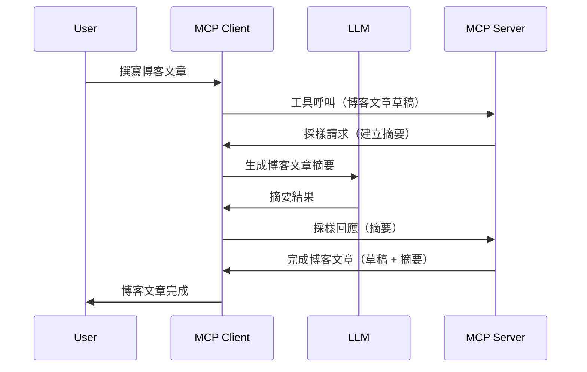

# 取樣 - 將功能委派給客戶端

有時候，您需要 MCP 用戶端和 MCP 伺服器協作以達成共同目標。您可能會遇到伺服器需要使用設置於用戶端的 LLM 協助的情況。針對這種情況，應該使用取樣。

讓我們探討一些用例以及如何構建涉及取樣的解決方案。

## 概述

在本課程中，我們專注於解釋何時及在哪裡使用取樣，以及如何配置它。

## 學習目標

本章節，我們將：

- 解釋什麼是取樣及其使用時機。
- 展示如何在 MCP 中配置取樣。
- 提供取樣實際應用的範例。

## 什麼是取樣及為何使用？

取樣是一個高級功能，運作方式如下：


### 取樣請求

好了，現在我們有了一個可信場景的宏觀視角，讓我們來談談伺服器發送回用戶端的取樣請求。下面是這種請求在 JSON-RPC 格式下的範例：

```json
{
  "jsonrpc": "2.0",
  "id": 1,
  "method": "sampling/createMessage",
  "params": {
    "messages": [
      {
        "role": "user",
        "content": {
          "type": "text",
          "text": "Create a blog post summary of the following blog post: <BLOG POST>"
        }
      }
    ],
    "modelPreferences": {
      "hints": [
        {
          "name": "claude-3-sonnet"
        }
      ],
      "intelligencePriority": 0.8,
      "speedPriority": 0.5
    },
    "systemPrompt": "You are a helpful assistant.",
    "maxTokens": 100
  }
}
```

這裡有幾點值得說明：

- Prompt，在 content -> text 下，是我們用來指示 LLM 摘要部落格文章內容的提示。

- **modelPreferences**，這部分就是偏好設定，是針對 LLM 使用的配置建議。用戶可以選擇接受這些建議或自行更改。在本例中，有關模型的建議以及速度和智能優先度的推薦。
- **systemPrompt**，這是您的正常系統提示，賦予您的 LLM 個性並包含指導說明。
- **maxTokens**，此屬性用於說明此任務建議使用的最大 token 數。

### 取樣回應

這個回應是 MCP 用戶端最終發送回 MCP 伺服器的結果，是用戶端呼叫 LLM、等待回應後組成的訊息。下面是 JSON-RPC 的範例：

```json
{
  "jsonrpc": "2.0",
  "id": 1,
  "result": {
    "role": "assistant",
    "content": {
      "type": "text",
      "text": "Here's your abstract <ABSTRACT>"
    },
    "model": "gpt-5",
    "stopReason": "endTurn"
  }
}
```

注意回應是部落格文章的摘要，就如我們所要求的。同時注意使用的 `model` 並非我們請求的 "claude-3-sonnet"，而是 "gpt-5"。這是為了說明用戶可以改變想法決定使用哪個模型，而您的取樣請求則是建議配置。

好了，現在我們了解了主要流程，以及一個實用任務「部落格文章創作 + 摘要」，接下來看看我們需要做什麼才能讓它運作。

### 訊息類型

取樣訊息不僅限於文字，也可以包含圖像和音訊。以下是 JSON-RPC 的不同樣貌：

**文字**

```json
{
  "type": "text",
  "text": "The message content"
}
```

**圖像內容**

```json
{
  "type": "image",
  "data": "base64-encoded-image-data",
  "mimeType": "image/jpeg"
}
```

**音訊內容**

```json
{
  "type": "audio",
  "data": "base64-encoded-audio-data",
  "mimeType": "audio/wav"
}
```

> 注意：關於取樣的詳細資訊，請參考[官方文件](https://modelcontextprotocol.io/specification/2025-06-18/client/sampling)

## 如何在用戶端配置取樣

> 注意：如果您僅在建構伺服器端，這部分不需進行太多設定。

在用戶端，您需要如下指定該功能：

```json
{
  "capabilities": {
    "sampling": {}
  }
}
```

此設定會在您所選的用戶端與伺服器初始化時被讀取。

## 取樣實例 - 建立部落格文章

讓我們一起編寫一個取樣伺服器，我們需要做如下步驟：

1. 在伺服器端建立一個工具。
1. 該工具應建立取樣請求。
1. 工具應等待用戶端取樣請求的回覆。
1. 然後應產生工具結果。

讓我們逐步看程式碼：

### -1- 建立工具

**python**

```python
@mcp.tool()
async def create_blog(title: str, content: str, ctx: Context[ServerSession, None]) -> str:
    """Create a blog post and generate a summary"""

```

### -2- 建立取樣請求

在您的工具中加入以下程式碼：

**python**

```python
post = BlogPost(
        id=len(posts) + 1,
        title=title,
        content=content,
        abstract=""
    )

prompt = f"Create an abstract of the following blog post: title: {title} and draft: {content} "

result = await ctx.session.create_message(
        messages=[
            SamplingMessage(
                role="user",
                content=TextContent(type="text", text=prompt),
            )
        ],
        max_tokens=100,
)

```

### -3- 等待回應並回傳結果

**python**

```python
post.abstract = result.content.text

posts.append(post)

# 返回完整產品
return json.dumps({
    "id": post.title,
    "abstract": post.abstract
})
```

### -4- 完整程式碼

**python**

```python
from starlette.applications import Starlette
from starlette.routing import Mount, Host

from mcp.server.fastmcp import Context, FastMCP

from mcp.server.session import ServerSession
from mcp.types import SamplingMessage, TextContent

import json


from uuid import uuid4
from typing import List
from pydantic import BaseModel


mcp = FastMCP("Blog post generator")

# app = FastAPI()

posts = []

class BlogPost(BaseModel):
    id: int
    title: str
    content: str
    abstract: str

posts: List[BlogPost] = []

@mcp.tool()
async def create_blog(title: str, content: str, ctx: Context[ServerSession, None]) -> str:
    """Create a blog post and generate a summary"""

    post = BlogPost(
        id=len(posts) + 1,
        title=title,
        content=content,
        abstract=""
    )

    prompt = f"Create an abstract of the following blog post: title: {title} and draft: {content} "

    result = await ctx.session.create_message(
        messages=[
            SamplingMessage(
                role="user",
                content=TextContent(type="text", text=prompt),
            )
        ],
        max_tokens=100,
    )

    post.abstract = result.content.text

    posts.append(post)

    # 回傳完整的博客文章
    return json.dumps({
        "id": post.title,
        "abstract": post.abstract
    })

if __name__ == "__main__":
    print("Starting server...")
    # mcp.run()
    mcp.run(transport="streamable-http")

# 用以下指令運行應用程式：python server.py
```

### -5- 在 Visual Studio Code 中測試

要在 Visual Studio Code 中測試，請依照以下步驟：

1. 在終端啟動伺服器
1. 將其加入 *mcp.json* （並確定它已啟動），例如如下：

   ```json
   "servers": {
      "blog-server": {
        "type": "http",
        "url": "http://localhost:8000/mcp"
      }
   }
   ```

1. 輸入提示語：

   ```text
   create a blog post named "Where Python comes from", the content is "Python is actually named after Monty Python Flying Circus"
   ```

1. 允許取樣進行。首次測試時，您會看到附加的對話視窗，需先接受，接著才會看到正常讓您執行工具的對話視窗。

1. 檢查結果。您會在 GitHub Copilot Chat 看到漂亮呈現的結果，也可檢視原始 JSON 回應。

**額外提示**。Visual Studio Code 工具對取樣有很好的支援。您可以透過以下方法配置在安裝伺服器上的取樣存取：

1. 進入擴充套件區域。
1. 在 "MCP SERVERS - INSTALLED" 區段選擇您已安裝伺服器的齒輪圖示。
1. 選擇 "Configure Model Access"，您可以在此選擇 GitHub Copilot 執行取樣時允許使用的模型。選擇 "Show Sampling requests" 可查看最近的所有取樣請求。

## 作業

本次作業您將建置一個稍有不同的取樣整合，支援產生產品描述。您的場景如下：

**場景**：電商後勤人員需要協助，生成產品描述花費太多時間。因此，您要建構一個解決方案，可以呼叫名稱為 "create_product" 的工具，傳入 "title" 和 "keywords" 作為參數，並由用戶端的 LLM 生成包含 "description" 欄位的完整產品資訊。

提示：使用之前學到的方式，如何利用取樣請求構建此伺服器及其工具。

## 解答

[解答](./solution/README.md)

## 主要收穫

取樣是一項強大功能，允許伺服器在需要 LLM 協助時將任務委派給用戶端。

## 下一步

- [第4章 - 實務實作](../../04-PracticalImplementation/README.md)

---

<!-- CO-OP TRANSLATOR DISCLAIMER START -->
**免責聲明**：
本文件已使用人工智能翻譯服務 [Co-op Translator](https://github.com/Azure/co-op-translator) 進行翻譯。雖然我們力求準確，但請注意自動翻譯可能包含錯誤或不準確之處。原文文件的母語版本應被視為權威來源。對於重要資訊，建議採用專業人工翻譯。我們對因使用本翻譯而引起的任何誤解或曲解概不負責。
<!-- CO-OP TRANSLATOR DISCLAIMER END -->