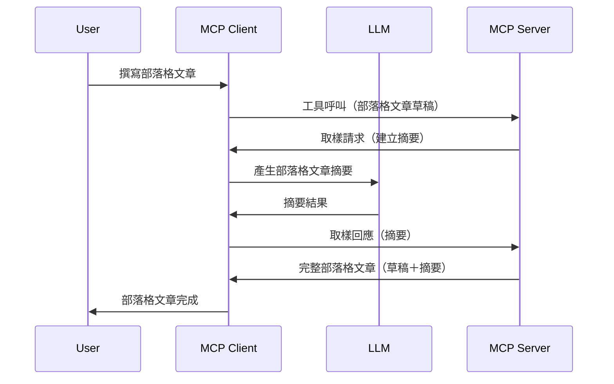

# 取樣 - 將功能委派給客戶端

有時候，你需要 MCP Client 和 MCP Server 協作以達成共同目標。你可能會遇到 Server 需要客戶端上的 LLM 協助的情況。針對這樣的情境，你應該使用取樣 (sampling)。

讓我們來探索一些使用案例以及如何構建包含取樣的解決方案。

## 概述

在本課中，我們將重點說明何時以及在哪裡使用取樣，並解釋如何配置它。

## 學習目標

本章節中，我們將：

- 解釋什麼是取樣以及何時使用。
- 展示如何在 MCP 中配置取樣。
- 提供取樣實際應用的範例。

## 什麼是取樣及為何使用？

取樣是一項進階功能，其運作方式如下：


### 取樣請求

好的，現在我們有了一個具有說服力場景的高階概觀，讓我們來談談 Server 傳回給 Client 的取樣請求。這樣的請求在 JSON-RPC 格式下可能長這樣：

```json
{
  "jsonrpc": "2.0",
  "id": 1,
  "method": "sampling/createMessage",
  "params": {
    "messages": [
      {
        "role": "user",
        "content": {
          "type": "text",
          "text": "Create a blog post summary of the following blog post: <BLOG POST>"
        }
      }
    ],
    "modelPreferences": {
      "hints": [
        {
          "name": "claude-3-sonnet"
        }
      ],
      "intelligencePriority": 0.8,
      "speedPriority": 0.5
    },
    "systemPrompt": "You are a helpful assistant.",
    "maxTokens": 100
  }
}
```

這裡有幾點值得注意：

- 提示 (Prompt) 在 content -> text 之下，是我們給 LLM 的指令，要求它摘要部落格文章內容。

- **modelPreferences**。這部分就是偏好設定，是對於 LLM 應如何配置的建議。使用者可以選擇接受這些建議或修改它們。本例中，有關使用模型以及速度和智慧優先權的建議。
- **systemPrompt**，這是你常見的系統提示，用以賦予你的 LLM 一個個性並包含指導說明。
- **maxTokens**，另一個屬性，用來指出建議本任務使用的最大 token 數。

### 取樣回應

此回應是 MCP Client 呼叫 LLM 後，等待回應並構造此訊息送回 MCP Server 的結果。以下是 JSON-RPC 的範例：

```json
{
  "jsonrpc": "2.0",
  "id": 1,
  "result": {
    "role": "assistant",
    "content": {
      "type": "text",
      "text": "Here's your abstract <ABSTRACT>"
    },
    "model": "gpt-5",
    "stopReason": "endTurn"
  }
}
```

請注意回應是我們要求的部落格文章摘要。另外請注意使用的 `model` 並不是我們原先請求的，而是 "gpt-5" 取代了 "claude-3-sonnet"。這是用來說明使用者可以改變他們的選擇，而你的取樣請求是一種建議。

好了，現在我們理解了主要流程，以及適合此功能的任務「部落格文章創作 + 摘要」，接著來看看我們需要做什麼才能讓它運作。

### 訊息類型

取樣訊息不限於文字，也可以傳送圖片和音頻。以下是 JSON-RPC 不同表現形式：

**文字**

```json
{
  "type": "text",
  "text": "The message content"
}
```

**圖片內容**

```json
{
  "type": "image",
  "data": "base64-encoded-image-data",
  "mimeType": "image/jpeg"
}
```

**音頻內容**

```json
{
  "type": "audio",
  "data": "base64-encoded-audio-data",
  "mimeType": "audio/wav"
}
```

> NOTE: 想要更詳細的取樣資訊，請參考[官方文件](https://modelcontextprotocol.io/specification/2025-06-18/client/sampling)

## 如何在客戶端配置取樣

> 注意：如果你只是在建置伺服器端，這部分不用做太多事情。

在客戶端，你需要像這樣指定以下功能：

```json
{
  "capabilities": {
    "sampling": {}
  }
}
```

當你選定的客戶端與伺服器初始化時，這會被撈取。

## 取樣實戰範例 - 建立部落格文章

讓我們一起寫一個取樣伺服器，我們需要做以下步驟：

1. 在伺服器建立一個工具。
1. 該工具應建立取樣請求。
1. 工具應等待客戶端對取樣請求的回應。
1. 接著工具產生結果。

讓我們逐步查看程式碼：

### -1- 建立工具

**python**

```python
@mcp.tool()
async def create_blog(title: str, content: str, ctx: Context[ServerSession, None]) -> str:
    """Create a blog post and generate a summary"""

```

### -2- 建立取樣請求

擴充你的工具，加入以下程式碼：

**python**

```python
post = BlogPost(
        id=len(posts) + 1,
        title=title,
        content=content,
        abstract=""
    )

prompt = f"Create an abstract of the following blog post: title: {title} and draft: {content} "

result = await ctx.session.create_message(
        messages=[
            SamplingMessage(
                role="user",
                content=TextContent(type="text", text=prompt),
            )
        ],
        max_tokens=100,
)

```

### -3- 等待回應並返回結果

**python**

```python
post.abstract = result.content.text

posts.append(post)

# 返回完整的產品
return json.dumps({
    "id": post.title,
    "abstract": post.abstract
})
```

### -4- 完整程式碼

**python**

```python
from starlette.applications import Starlette
from starlette.routing import Mount, Host

from mcp.server.fastmcp import Context, FastMCP

from mcp.server.session import ServerSession
from mcp.types import SamplingMessage, TextContent

import json


from uuid import uuid4
from typing import List
from pydantic import BaseModel


mcp = FastMCP("Blog post generator")

# app = FastAPI()

posts = []

class BlogPost(BaseModel):
    id: int
    title: str
    content: str
    abstract: str

posts: List[BlogPost] = []

@mcp.tool()
async def create_blog(title: str, content: str, ctx: Context[ServerSession, None]) -> str:
    """Create a blog post and generate a summary"""

    post = BlogPost(
        id=len(posts) + 1,
        title=title,
        content=content,
        abstract=""
    )

    prompt = f"Create an abstract of the following blog post: title: {title} and draft: {content} "

    result = await ctx.session.create_message(
        messages=[
            SamplingMessage(
                role="user",
                content=TextContent(type="text", text=prompt),
            )
        ],
        max_tokens=100,
    )

    post.abstract = result.content.text

    posts.append(post)

    # 回傳完整的部落格文章
    return json.dumps({
        "id": post.title,
        "abstract": post.abstract
    })

if __name__ == "__main__":
    print("Starting server...")
    # mcp.run()
    mcp.run(transport="streamable-http")

# 使用以下指令啟動應用程式：python server.py
```

### -5- 在 Visual Studio Code 中測試

在 Visual Studio Code 測試此功能，請依序執行：

1. 在終端機啟動伺服器
1. 將它加入 *mcp.json*（並確保啟動） 例如：

   ```json
   "servers": {
      "blog-server": {
        "type": "http",
        "url": "http://localhost:8000/mcp"
      }
   }
   ```

1. 輸入提示：

   ```text
   create a blog post named "Where Python comes from", the content is "Python is actually named after Monty Python Flying Circus"
   ```

1. 允許取樣進行。第一次測試時會跳出額外對話框需要你接受，之後你會看到正常的對話框詢問是否執行工具。

1. 檢視結果。你會看到在 GitHub Copilot Chat 中漂亮呈現的結果，並且也能檢查原始 JSON 回應。

**加分**。Visual Studio Code 工具有很好的取樣支援。你可以這樣配置已安裝伺服器的取樣權限：

1. 前往擴充功能區域。
1. 在「MCP SERVERS - INSTALLED」區塊選擇你已安裝的伺服器，點齒輪圖示。
1. 選擇「Configure Model Access」，在這裡你可以選擇 GitHub Copilot 在執行取樣時允許使用哪些模型。你也可以透過「Show Sampling requests」查看最近所有的取樣請求。

## 作業

這次作業是建置一個稍微不同的取樣整合功能，即支援生成產品描述的取樣工具。情境如下：

**情境**：電商後台工作者在生成產品描述上花費太多時間，因此你要建置一個解決方案，能透過呼叫工具「create_product」，並以「title」及「keywords」作為參數，產生包含「description」欄位的完整產品描述，該說明欄位將由客戶端的 LLM 填充。

TIP：運用先前學到如何用取樣請求構造伺服器及其工具的技巧。

## 解答

[Solution](./solution/README.md)

## 主要重點

取樣是一項強大的功能，讓伺服器在需要 LLM 協助時，可以將任務委派給客戶端。

## 接下來要學習什麼

- [第四章 - 實作範例](../../04-PracticalImplementation/README.md)

---

<!-- CO-OP TRANSLATOR DISCLAIMER START -->
**免責聲明**：  
本文件係使用 AI 翻譯服務 [Co-op Translator](https://github.com/Azure/co-op-translator) 進行翻譯。雖然我們力求準確，但請注意自動翻譯可能包含錯誤或不準確之處。原始文件的母語版本應視為權威來源。對於重要資訊，建議採用專業人工翻譯。我們不對因使用此翻譯而產生的任何誤解或誤釋負責。
<!-- CO-OP TRANSLATOR DISCLAIMER END -->